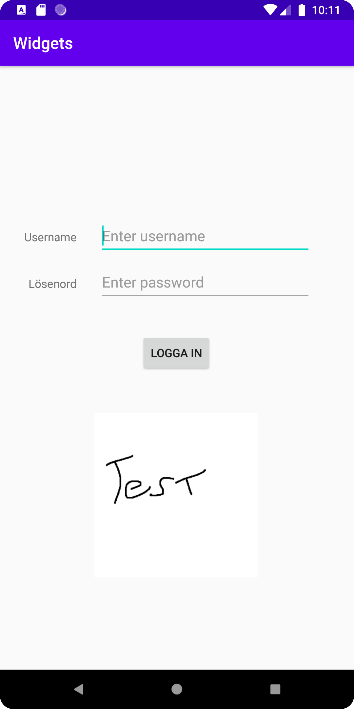

# Rapport

Målet var att skapa en inloggningskärm.

1. ConstraintLayout används i uppgiften. Layout av denna typ fanns redan i activity_main.
2. Två textviews lades till. Dessa har sina fyra constraints till parent men har placerats manuellt.


```
    <TextView
        android:id="@+id/usernameText"
        android:layout_width="wrap_content"
        android:layout_height="wrap_content"
        android:text="Username"
        app:layout_constraintBottom_toBottomOf="parent"
        app:layout_constraintHorizontal_bias="0.028"
        app:layout_constraintLeft_toLeftOf="parent"
        app:layout_constraintRight_toRightOf="parent"
        app:layout_constraintTop_toTopOf="parent"
        app:layout_constraintVertical_bias="0.278"
        android:layout_marginLeft="20dp"
        android:layout_marginStart="20dp" />

    <TextView
        android:id="@+id/passwordText"
        android:layout_width="wrap_content"
        android:layout_height="wrap_content"
        android:text="Lösenord"
        app:layout_constraintBottom_toBottomOf="parent"
        app:layout_constraintHorizontal_bias="0.042"
        app:layout_constraintLeft_toLeftOf="parent"
        app:layout_constraintRight_toRightOf="parent"
        app:layout_constraintTop_toBottomOf="@+id/usernameText"
        app:layout_constraintVertical_bias="0.076"
        android:layout_marginLeft="20dp"
        android:layout_marginStart="20dp" />
        />
```
3. Button lades till, även här constraints till parent men placerad manuellt.
```
   <Button
   android:id="@+id/homeButton"
   android:layout_width="wrap_content"
   android:layout_height="wrap_content"
   android:text="Logga in"
   app:layout_constraintBottom_toBottomOf="parent"
   app:layout_constraintEnd_toEndOf="parent"
   app:layout_constraintHorizontal_bias="0.498"
   app:layout_constraintStart_toStartOf="parent"
   app:layout_constraintTop_toTopOf="parent"
   app:layout_constraintVertical_bias="0.474" />
```

4. EditText läggs till, en för varje textview. Dessa har samma constraints förutom
    sin väntra sida, som har constraint till höger sida av sin textview. Se ```"@+id/usernameText"```

```
    <EditText
        android:id="@+id/usernameEdittext"
        android:layout_width="260dp"
        android:layout_height="wrap_content"
        android:inputType="text"
        android:minHeight="48dp"
        android:hint="Enter username"
        app:layout_constraintBottom_toBottomOf="parent"
        app:layout_constraintEnd_toEndOf="parent"
        app:layout_constraintHorizontal_bias="0.342"
        app:layout_constraintStart_toEndOf="@+id/usernameText"
        app:layout_constraintTop_toTopOf="parent"
        app:layout_constraintVertical_bias="0.267" />

    <EditText
        android:id="@+id/passwordEdittext"
        android:layout_width="260dp"
        android:layout_height="wrap_content"
        android:minHeight="48dp"
        android:hint="Enter password"
        app:layout_constraintBottom_toBottomOf="parent"
        app:layout_constraintEnd_toEndOf="parent"
        app:layout_constraintHorizontal_bias="0.342"
        app:layout_constraintStart_toEndOf="@+id/usernameText"
        app:layout_constraintTop_toTopOf="parent"
        app:layout_constraintVertical_bias="0.349"
        android:inputType="text" />
```

6. Margins läggs till på textViews på vänster sida.

```
    <TextView
        android:id="@+id/passwordText"
        android:layout_width="wrap_content"
        android:layout_height="wrap_content"
        android:text="Lösenord"
        app:layout_constraintBottom_toBottomOf="parent"
        app:layout_constraintHorizontal_bias="0.042"
        app:layout_constraintLeft_toLeftOf="parent"
        app:layout_constraintRight_toRightOf="parent"
        app:layout_constraintTop_toBottomOf="@+id/usernameText"
        app:layout_constraintVertical_bias="0.076"
        android:layout_marginLeft="20dp"
        android:layout_marginStart="20dp" />
```

5. Importerar bild (skapad i paint)  i resource manager samt skapar en imageView som pekar på bilden.

```
    <ImageView
        android:id="@+id/imageView3"
        android:layout_width="200dp"
        android:layout_height="200dp"
        android:contentDescription="his logo"
        app:layout_constraintBottom_toBottomOf="parent"
        app:layout_constraintEnd_toEndOf="parent"
        app:layout_constraintHorizontal_bias="0.497"
        app:layout_constraintStart_toStartOf="parent"
        app:layout_constraintTop_toTopOf="parent"
        app:layout_constraintVertical_bias="0.789"
        app:srcCompat="@drawable/testlogo" />
```

6. testkör appen, som verkar fungera bra.

Slutresultat:


